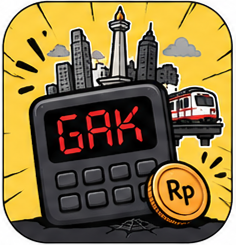

<p align="right">
  <a href="./README.md">🇬🇧 English</a>
</p>

<p align="center">
  <picture>
    <source media="(prefers-color-scheme: dark)" srcset="./assets/02_BANNER_DARK.png">
    
  </picture>
</p>

<p align="center">
  
</p>

<h1 align="center">CukupGak — Kalkulator Kelayakan Gaji Jakarta</h1>

<p align="center">
  Estimasi apakah gajimu cukup untuk biaya hidup di Jakarta dan sekitarnya. <br/>
  Masukkan gaji dan profil hidup — dapatkan take-home setelah pajak, breakdown biaya, dan verdict.
</p>

<p align="center">
  <a href="https://faisalaffan.github.io/cukupgak"><strong>🔗 Live Demo</strong></a>
  &nbsp;·&nbsp;
  <a href="#-stack"><strong>Stack</strong></a>
  &nbsp;·&nbsp;
  <a href="#-cara-kerja"><strong>Cara Kerja</strong></a>
  &nbsp;·&nbsp;
  <a href="#-development"><strong>Development</strong></a>
  &nbsp;·&nbsp;
  <a href="#-batasan"><strong>Batasan</strong></a>
</p>

## 📦 Stack

Nuxt 3 + TypeScript + Tailwind CSS, static generate.

## 🧠 Cara Kerja

1. **Input:** gaji bruto/neto, zona domisili, status pernikahan, transportasi, hunian, gaya makan, gaya hidup
2. **Potongan:** PPh 21 tarif progresif 2024 + BPJS Kesehatan (1%, cap Rp 120.000) + BPJS Ketenagakerjaan (2%)
3. **Biaya hidup:** estimasi berdasarkan kombinasi zona × status × pola hidup
4. **Verdict:** Layak Banget (≥30% tabungan) sampai Tidak Layak (defisit)

## 🛠 Development

```bash
pnpm install
pnpm dev            # http://localhost:3000
pnpm test           # Vitest (unit)
pnpm test:e2e       # Playwright (e2e)
pnpm generate       # Static build → .output/public/
```

## ⚠️ Batasan

- Tidak termasuk: cicilan, dana darurat, tunjangan kantor, bonus/THR
- Estimasi biaya hidup adalah rata-rata — realita bisa ±20–30%
- Mode gaji neto menggunakan kalkulasi balik satu langkah (aproksimasi)

## 📄 Lisensi

MIT © 2026 Faisal Affan
